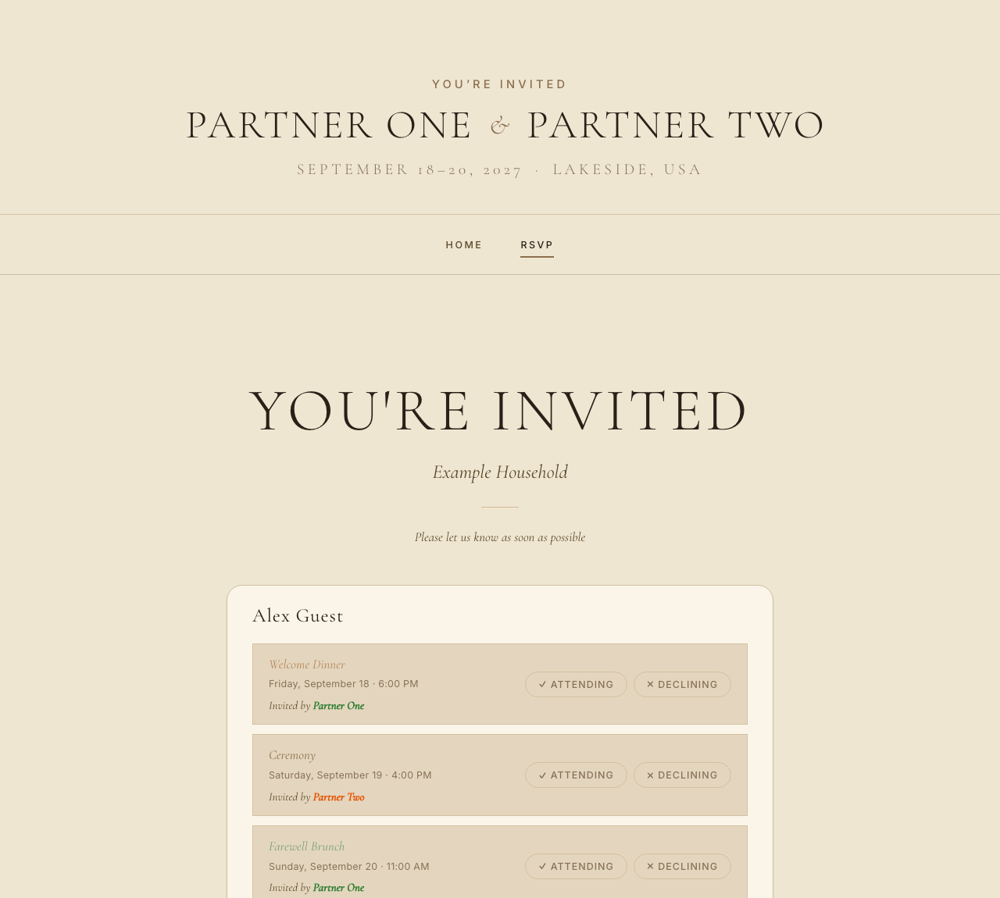
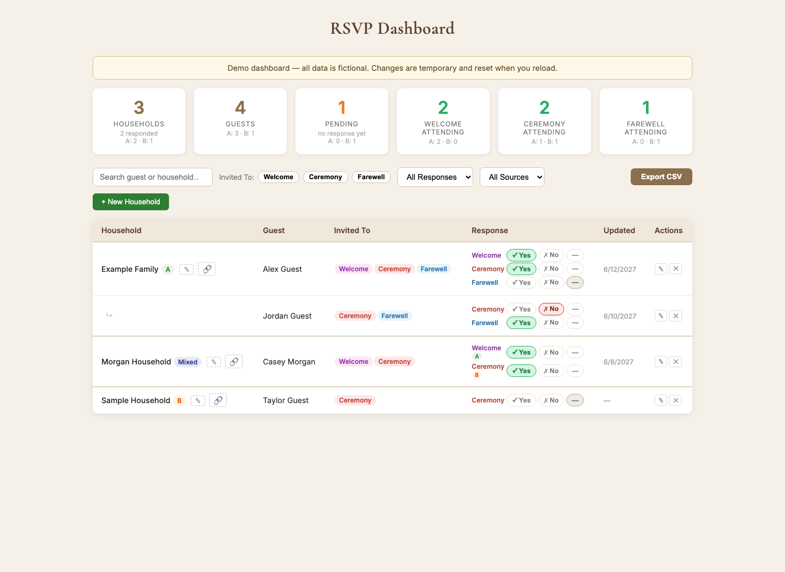

# Wedding RSVP website template

A customizable wedding website with a private invite-code RSVP flow, a
Cloudflare Worker and D1 backend, an admin dashboard, guest import tools, and
optional Twilio invitations.

The repository contains only fictional example content and placeholder media.
Create a private repository from this template before adding real names, guest
details, addresses, photos, or credentials.


## Included

```text
site/                    Static website, RSVP flow, and admin dashboard
site/dashboard/          Dashboard with a safe browser-only demo
worker/                  Cloudflare Worker API written in TypeScript
scripts/                 Guest-token, D1 import, and optional Twilio tools
schema.sql               Cloudflare D1 database schema
docs/images/             Fictional screenshots used by this guide
.github/workflows/       Manual GitHub Pages deployment workflow
```

The Worker stores only SHA-256 hashes of invite codes. Raw invite codes are
created by the local import tools and never stored in D1.

## Try it locally in two minutes

You only need Python for the frontend demos:

```bash
python3 -m http.server 5050 --directory site
```

Then open:

- Website: `http://localhost:5050/`
- RSVP demo: `http://localhost:5050/rsvp/?demo=1`
- Dashboard demo: `http://localhost:5050/dashboard/?demo=1`

The dashboard demo can also be opened from `/dashboard/` by entering `demo` as
the PIN or clicking **Open demo dashboard**. It uses fictional data in memory,
makes no backend requests, and resets every change when the page reloads.

## RSVP experience

Each household receives one short invite code. The RSVP page loads every guest
in that household and shows only the events to which each guest is invited.
Guests can accept or decline each event separately.



The built-in `?demo=1` route is safe to share as a visual preview because it
does not read or write D1.

## Dashboard guide

Open `/dashboard/`. Use `demo` for the fictional sandbox or your private
`DASHBOARD_PIN` for live data.



### Summary cards

The top row shows household and guest totals, pending guests, and attendance by
event. Select a card to filter the guest table to the corresponding group.
Attendance cards also show the optional source-list split.

### Search and filters

- Search by guest or household name.
- Select one or more **Invited To** chips.
- Filter by attending, declining, or pending status.
- Filter by source list `A`, `B`, or `Mixed`.
- Select sortable table headings to change the ordering.

### RSVP management

- Use the Yes, No, and pending controls to correct a response.
- Select the pencil beside a guest to change their name, events, or source.
- Select the household pencil to edit everyone in that household together.
- Use **New Household** to create a household and its first guests.
- Remove a guest through the delete action and confirmation dialog.
- Use the link action to generate a replacement RSVP code. The previous code
  stops working when a real backend is connected.
- Use **Export CSV** to download the currently filtered dashboard view.

Demo-mode edits behave like the live controls but remain only in the current
browser tab. Reloading restores the original fictional records.

## How the system fits together

```text
Guest browser             Admin browser
     |                          |
     | invite code              | Bearer DASHBOARD_PIN
     v                          v
             Cloudflare Worker API
                       |
                       v
                 Cloudflare D1
```

Public routes look up an invite and save RSVPs. Admin routes require the Worker
secret and provide reporting, response corrections, guest management, and code
regeneration.

| Method | Route | Purpose |
| --- | --- | --- |
| `GET` | `/api/invite?t=CODE` | Load a household invitation |
| `POST` | `/api/rsvp?t=CODE` | Save guest responses |
| `GET` | `/api/admin/rsvps` | Load dashboard data |
| `PATCH` | `/api/admin/rsvp` | Correct a response |
| `POST` | `/api/admin/household` | Create a household |
| `POST` | `/api/admin/guest` | Add a guest |
| `PATCH` | `/api/admin/guest` | Edit a guest |
| `DELETE` | `/api/admin/guest` | Remove a guest |
| `POST` | `/api/admin/regenerate-token` | Replace a household code |

## Prerequisites for a live deployment

- Node.js 20 or newer
- A Cloudflare account for Workers and D1
- A GitHub repository if using GitHub Pages
- A Twilio account only if sending invitation texts

## 1. Create a private working copy

Click **Use this template** on GitHub and create a private repository. Clone
that private copy before adding personal information:

```bash
git clone https://github.com/YOURUSERNAME/YOUR-PRIVATE-WEDDING-REPO.git
cd YOUR-PRIVATE-WEDDING-REPO
```

Keep the included `.gitignore`. It excludes the common guest-data, raw-code,
credential, and local database files used by this project.

## 2. Customize the frontend

Replace the fictional values in the following files:

| File | What to update |
| --- | --- |
| `site/index.html` | Names, dates, location, captions, and page metadata |
| `site/schedule/index.html` | Event names, dates, times, and descriptions |
| `site/rsvp/index.html` | Names, dates, and RSVP copy |
| `site/js/home.js` | `WEDDING_DATE` used by the countdown |
| `site/js/rsvp.js` | Production `API_BASE`, events, labels, and demo data |
| `site/dashboard/index.html` | Production URLs, events, source labels, SMS copy, and demo rows |
| `worker/src/index.ts` | Matching event keys and optional source labels |
| `worker/wrangler.toml` | Worker name, D1 ID, allowed origins, and wedding date |

Replace the files in `site/assets/` with appropriately licensed artwork and
photos, or remove image elements you do not need. Keep private photos in the
private wedding repository, never in the public template.

Event keys must agree everywhere: the RSVP page, dashboard, Worker, guest CSV,
and D1 records. This template uses `welcome`, `ceremony`, and `farewell`.
Source codes `A` and `B` are optional labels for the two sides of a guest list.

## 3. Run the complete stack locally

Install the Worker dependencies:

```bash
cd worker
npm install
```

Create the ignored local secret file and choose a development-only PIN:

```bash
cp .dev.vars.example .dev.vars
```

Edit `worker/.dev.vars`:

```dotenv
DASHBOARD_PIN=choose-a-local-only-pin
```

Initialize local D1 and start the Worker:

```bash
npm run db:migrate:local
npm run dev
```

In a second terminal, start the frontend from the repository root:

```bash
python3 -m http.server 5050 --directory site
```

When the frontend hostname is `localhost` or `127.0.0.1`, the RSVP page and
dashboard automatically use the local Worker at `http://localhost:8787`.
Enter the PIN from `.dev.vars` to use the database-backed dashboard. Enter
`demo` instead when you want the disposable sandbox.

## 4. Create the production D1 database

Authenticate and create the database:

```bash
cd worker
npx wrangler login
npx wrangler d1 create your-wedding-rsvp
```

Copy the returned database ID into `worker/wrangler.toml`:

```toml
[[d1_databases]]
binding = "DB"
database_name = "your-wedding-rsvp"
database_id = "PASTE_THE_DATABASE_ID_HERE"
```

Create the tables and indexes:

```bash
npm run db:migrate:remote
```

## 5. Configure and deploy the Worker

Set exact frontend origins in `worker/wrangler.toml`. Origins have no trailing
path:

```toml
[vars]
ALLOWED_ORIGINS = "https://YOURUSERNAME.github.io,http://localhost:5050"
WEDDING_DATE = "2027-09-18"
```

Create a long, random production dashboard credential. Wrangler stores it as a
secret; do not put it in source files:

```bash
npx wrangler secret put DASHBOARD_PIN
```

Type-check and deploy:

```bash
npm run type-check
npm run deploy
```

Copy the resulting `https://...workers.dev` URL into the production fallback
for `API_BASE` in:

- `site/js/rsvp.js`
- `site/dashboard/index.html`

Also update `PUBLIC_RSVP_URL` in `site/dashboard/index.html` so generated links
point to the deployed RSVP page.

## 6. Prepare and import guests

Copy the fictional CSV into the ignored working filename:

```bash
cp scripts/guests.csv.example scripts/guests.csv
```

Use one row per guest:

```csv
household_label,phone_e164,guest_name,events,source_list
"Example Family",+15550101001,"Alex Guest",welcome|ceremony|farewell,A
```

- Use E.164 phone numbers, including the country code.
- Reuse the same phone number to group guests into one household.
- Separate multiple event keys with `|`.
- Use source `A` or `B`, or leave it blank.

Generate household codes and import SQL from the repository root:

```bash
node scripts/generate_tokens.mjs \
  --input=scripts/guests.csv \
  --base-url=https://YOURUSERNAME.github.io/YOUR-REPO/rsvp

node scripts/import_to_d1.mjs --output=scripts/seed.sql
cd worker
npx wrangler d1 execute your-wedding-rsvp --remote --file=../scripts/seed.sql
```

The generated files are ignored because they contain private or usable data:

| File | Contents |
| --- | --- |
| `scripts/import.csv` | Names, phone numbers, and token hashes |
| `scripts/sms.csv` | Names, phone numbers, raw invite codes, and RSVP URLs |
| `scripts/seed.sql` | D1 seed data |

Store them securely. Raw invite codes cannot be recovered from the hashes in
D1.

To seed the local database instead, replace `--remote` with `--local` in the
final command.

## 7. Publish the frontend with GitHub Pages

The included workflow publishes only `site/` and runs manually.

1. Push the customized private repository to GitHub.
2. Open **Settings → Pages**.
3. Set **Source** to **GitHub Actions**.
4. Run **Deploy frontend to GitHub Pages** from the Actions tab.
5. Add the final Pages origin to `ALLOWED_ORIGINS`.
6. Confirm `API_BASE` and `PUBLIC_RSVP_URL`, then redeploy the Worker.

The dashboard lives at `/dashboard/`. An unlisted URL is not access control;
live dashboard data is protected by `DASHBOARD_PIN` in the Worker.

## 8. Optional Twilio invitations

Edit `buildMessage()` in `scripts/send_sms_twilio.mjs`, then install the script
dependency and run a dry run:

```bash
cd scripts
npm install
export TWILIO_ACCOUNT_SID=ACxxxxxxxxxxxxxxxxxxxxxxxxxxxxxxxx
export TWILIO_AUTH_TOKEN=your_auth_token
export TWILIO_FROM=+15550001234

node send_sms_twilio.mjs --dry-run
node send_sms_twilio.mjs --confirm --to=+15550001234
node send_sms_twilio.mjs --confirm
```

Set `TWILIO_MESSAGING_SERVICE_SID` instead of `TWILIO_FROM` when using a Twilio
Messaging Service. Review consent and messaging requirements before contacting
guests.

## Troubleshooting

### The dashboard says “Failed to connect”

- For the no-backend preview, use `/dashboard/?demo=1` or enter `demo`.
- For live local data, confirm Wrangler is running on port `8787`.
- Confirm `DASHBOARD_PIN` exists in `worker/.dev.vars`.
- Confirm `http://localhost:5050` is listed in `ALLOWED_ORIGINS`.
- For production, confirm both frontend files use the deployed Worker URL.

### An invite code is not found

- Confirm the raw code came from the latest `scripts/sms.csv`.
- Confirm `seed.sql` was imported into the intended local or remote database.
- Regenerated codes invalidate the previous household code.

### Dashboard totals look unexpected

- Confirm event keys match across every configuration file.
- Check whether a source filter or event chip is active.
- Remember that pending means a guest has no submitted response.

## Privacy checklist before every push

```bash
git status --short
git ls-files scripts
rg -n -i "phone|token|address|@|workers\\.dev" . \
  -g '!node_modules/**' -g '!package-lock.json'
```

Confirm that:

- Only fictional example CSV data is tracked.
- No private photos or invitation artwork are tracked publicly.
- Deployment IDs and URLs are placeholders in the public template.
- `.dev.vars`, generated guest files, and raw invite codes are ignored.
- No real guest information ever entered the public Git history.

If private information enters Git history, deleting the current file is not
enough. Rewrite the history or create a fresh repository before publishing.

See [SECURITY.md](SECURITY.md) for deployment-specific guidance.

## License

MIT
